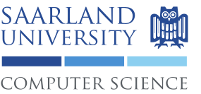
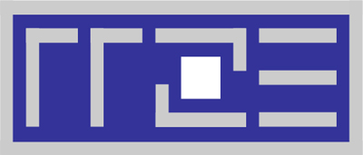

{: style="text-align:center"}
{: style="width:50%"}

Metacca is a research project funded by the German Federal Ministry of Education and Research (BMBF) through a [directive for funding](https://www.bmbf.de/foerderungen/bekanntmachung-1105.html) for "basic research for HPC software in high-performance computing".
The goal of Metacca is to extend the [AnyDSL](https://anydsl.github.io) framework into a homogeneous programming environment for heterogeneous single- and multi-node systems.
To this effect, the existing programming language and compiler will be extended by an expressive type system and language features enabling efficient programming of accelerators.
Significant aspects of this extension concern the modelling of memory on heterogeneous devices, distribution of data to multiple compute nodes and improving the precision and power of the partial evaluation approach.

Within the project further support for distribution and synchronization for data-parallel programs will be built on top of these language enhancements as a library making use of AnyDSL's partial evaluation features.
Performance models and static analysis tools will be integrated into the AnyDSL tool chain to support development of applications and tuning of parameters.
A runtime environment with built-in performance profiling will take care of resource management and system configuration.
The resulting framework is evaluated using applications from bioinformatics and ray tracing.
The target platforms are single heterogeneous nodes and clusters with several accelerators.

## Project Partners

{: style="width:150px"}

Among other research projects, the [Compiler Design Lab](http://compilers.cs.uni-saarland.de) at Saarland University develops the AnyDSL framework including the Impala programming language, the Thorin intermediate language, their type systems and compiler.

{: style="width:150px"}

The research department [Agents and Simulated Reality](https://www.dfki.de/web/research/asr) at the German Research Center for Artificial Intelligence (DFKI) develops the AnyDSL framework with focus on acceleration of rendering applications using ray tracing and global illumination on multi-core CPUs, GPUs, and Xeon Phis.

{: style="width:150px"}

The Erlangen Regional Computing Center (RRZE) at Friedrich-Alexander-University Erlangen-Nuremberg is active in many performance engineering related research projects. The RRZE has developed the [likwid Tool suite](https://github.com/RRZE-HPC/likwid) and the [Kerncraft Performance Modeling Toolkit](https://github.com/RRZE-HPC/kerncraft). Moreover RRZE has developed the Execution-Cache-Memory (ECM) performance model.

### [JGU Mainz, Scientific Computing and Bioinformatics](http://www.bio.informatik.uni-mainz.de)

### [JGU Mainz, High Performance Computing](http://www.hpc.informatik.uni-mainz.de)

### [FAU Erlangen-Nürnberg, System Simulation Group](https://www10.informatik.uni-erlangen.de/en/)
